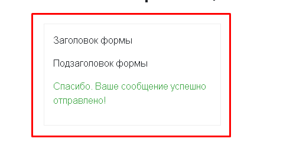

## Форма обратной связи ##

### Назначение ###

Решение позволяет создавать на сайте разнообразные веб-формы для обработки, хранения и систематизации полученной информации.

### Получение файлов решения ###

Для получения файлов решения необходимо клонировать репозиторий на локальную установку или загрузить архив. Структура файлов и папок повторяет структуру файлов и папок на сайте.

### Установка решения ###

Загрузите файлы решения к себе на сайт. Файлы должны располагаться в папке /local/ от корня сайта, как показано на скриншоте.

Разместите компонент формы обратной связи на новой или уже существующей странице вашего сайта. При необходимости обновите список существующих компонентов.

Установите компонент на странице и перейдите к настройкам параметров компонента.

### Настройка решения ###

Компонент обладает достаточно большим количеством гибко настраиваемых параметров. Это позволит вам создать любую интересующую вас форму обратной связи. Начиная от традиционной формы обратной связи и заканчивая формой заказа обратного звонка или отправкой резюме. 

Раздел “Настройки формы”:

**Включить режим ajax** – при выборе данной опции, отправка формы будет происходить в режиме ajax т.е без перезагрузки страницы.

**Заголовок формы** – можно установить произвольный заголовок формы.

**Подзаголовок формы** – можно установить произвольный подзаголовок формы или её описание.

**Текст на кнопке Отправить** – можно установить произвольный текст на кнопке отправки формы.

**Текст при успешной отправке формы** – можно установить произвольный текст который будет показан пользователю после успешной отправки формы.

**Текст при возникновении ошибок** – можно установить произвольный текст который будет показан пользователю если по каким-то причинам форму не удалось отправить (т.е возникла ошибка).

**Идентификатор формы (обязательное поле, любой уникальный набор символов!)** – данная настройка обязательная для заполнения в случае если вы планируете размещать несколько разных веб-форм на одной странице. 

Раздел “Настройки инфоблока”:

**Выберите тип инфоблока** – необходимо выбрать тип инфоблока в котором будут храниться отправленные сообщения.

**Выберите инфоблок** - необходимо выбрать инфоблок в котором будут храниться отправленные сообщения.

Раздел “Настройки почтового шаблона”:

**Выберите почтовый шаблон** – необходимо выбрать почтовый шаблон который будет отправляться администратору по факту заполнения формы на сайте.

Вы можете использовать любой существующий почтовый шаблон или создать новый. В шаблоне должны быть добавлены следующие макросы: #NAME#, #EMAIL#, #PHONE#, #FILE#, #MESSAGE#

Пример почтового шаблона:

----

Вам было отправлено новое сообщение:

Имя: #NAME#

Email: #EMAIL#

Телефон: #PHONE#

Ссылка на файл: #FILE#

Сообщение: #MESSAGE#

----

Разделы “Поле Имя, Поле Email, Поле Телефон, Поле Сообщение, Поле Файл”:

В данных разделах производится точечная настройка полей формы (обязательность заполнения поля, видимость поля в форме, наличия телефонной маски, ограничение на размер загружаемого файла и.т.д). **Здесь нужно обратить особое внимание на настройку соответствия полей формы и свойств выбранного инфоблока.**

Например, у вас есть инфоблок “Отзывы” или любой другой. Такой инфоблок необходимо предварительно настроить, как показано на скриншоте. т.е заранее создать свойства с которыми будет работать компонент.

В настройках компонента вам останется настроить соответствие всех полей формы с свойствами инфоблока, как показано на скриншоте.

В случае если компонент будет некорректно настроен вы увидите соответствующее уведомление. В этом случае вам необходимо вернуться к настройкам компонента и проверить настройки.

В случае если вы все сделали верно, на сайте появится форма в соответствии с вашими настройками.

После успешной отправки формы, форма скрывается - пользователю выводится уведомление. Все сообщения хранятся в отдельно настроенном для каждой формы инфоблоке.

Для удобства интеграции веб-форм на вашем сайте, решение содержит несколько файлов миграций позволяющих быстро создать необходимые инфоблоки и почтовый шаблон. Файлы миграций располагаются в папке /reducemigrations/

Подробнее о использовании миграций: https://github.com/worksolutions/bitrix-reduce-migrations

### Результат ###

В результате вы получите инструмент, с помощью которого сможете создавать любое количество гибко настраиваемых веб-форм на вашем сайте.

